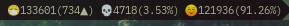

# Corona-chan Tracker


This script displays covid-19 data formatted for statusbars and/or panels.
So far tried and tested in mate-panel, polybar and wibar (awesomewm), it should work in other desktop enviorements and perhaps in bitbar for mac.

## Install

```sh
git clone https://github.com/eylles/corona-chan-tracker
cd corona-chan-tracker
make install
```

There's an automated way to add an example cronjob just run ```make cronadd``` after running ```make install```.

## How To Use

for example to get the data for brazil run
```
covid -l br
```
Usage: covid [options] -l [string]
Options:
   -c: Run as client cicle.
	 -0: Run as client once.
   -s: Silence output.
   -n: Do not log output.
   -u: USA states stats.
   -l: enter location as [-l string].
   -h: Display this help.

## screenshot
running inside awesomewm on the wibar



this is how you add it
```lua
...
        { -- Right widgets
            layout = wibox.layout.fixed.horizontal,
						awful.widget.watch('covid -0 -l --country code--', 180),
...
```

## credits
Luke Smith's [video](https://www.youtube.com/watch?v=cQ03v4d3QEo) on whcih he writes a script, which served as the base for this scrip
sagarkarira's [Coronavirus Tracker Cli](https://github.com/sagarkarira/coronavirus-tracker-cli) as this script uses it's curl interface


(no longer true as it has a makefile now)
